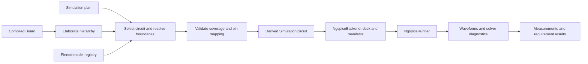

# Simulation backend research and proposal

Research date: 2026-10-03. This document preserves the original proposal and future API sketches. The first implementation now supports separate JSON plans, ngspice export/run, AC sweeps and Bode plots, transient/inrush scenarios, checked local model bundles, numerical limits and offline visual reports. See [the simulation guide](simulation.md) and `examples/simulation/` for the implemented schema and CLI. Vendor model qualification and compatibility profiles remain future work.

## Recommendation

Add an **ngspice netlist backend plus a separate simulator runner**, driven by an explicit simulation plan. Start with selected analog and power circuits rather than attempting to simulate every device on a board. Keep model bindings and test stimuli outside the authoritative electrical IR.

The first useful outcome should be a reproducible startup/inrush scenario and an RC filter scenario: generated SPICE deck, model coverage report, waveforms, measured limits, Bode plots, transient graphs, and provenance. AC frequency sweeps and visual feedback are required in the first simulation release. Once those work, qualify vendor amplifier and load-switch models. Switching regulators and transistor stress analysis need further model validation.

ngspice supports circuit netlists and batch execution and is available across the desktop platforms CopperScript uses. Its official news page lists version 47, released on 2026-08-11. Treat that as the first version to qualify, not an automatic dependency upgrade policy. [ngspice introduction](https://ngspice.sourceforge.io/index.html), [release news](https://ngspice.sourceforge.io/news.html)

## Fit with the current repository

The relevant existing pieces are:

| Current code | How simulation can use it |
| --- | --- |
| `pcbir/model.py`: `Board`, `ComponentInstance`, `Net`, `Supply`, `PartDefinition` | Authoritative connectivity, typed values, part identity and source provenance |
| `pcbir/elaborate.py`: `elaborate(Board)` | Deterministic flat view that retains module paths |
| `pcbir/backends/base.py`: `Backend.generate(Board) -> ArtifactManifest` | Generate SPICE decks and text manifests without changing the design |
| `pcbir/quantities.py` | SI-normalized resistance, capacitance, inductance, voltage, current and frequency |
| `pcbir/power.py`: `analyze_power_states` | Existing static ON/OFF/UNKNOWN checks; complementary to time-domain simulation |
| `pcbir/model.py`: constraint IDs, origins and consumers | Associate a measured result with the requirement it checks |
| `scripts/ci_board_bundle.py` | Existing subprocess timeout, process-group termination, logs and provenance patterns |

There is no simulation model binding or transient scenario type today. `Supply.voltage` declares electrical intent; it does not specify a source waveform, impedance or current limit. In particular, the illustrative buck module declares its output rail as externally driven for ERC. Converting that declaration to an ideal SPICE voltage source would clamp the very regulator output we want to simulate.

Add a small typed `SimulationPlan` and derived `SimulationCircuit`; do not overload part metadata strings or teach the backend to reparse CopperScript. Introduce typed time first, and power/energy/charge when those measurements are exposed. Frequency already exists. Temperature needs a declared convention rather than an ambiguous number.

## Engine and integration options

| Option | Recommendation |
| --- | --- |
| ngspice executable in a subprocess | First adapter. Explicit decks, logs and files; fits current CLI/CI; a crashed or timed-out solve is confined to its process |
| ngspice shared library | Later, if interactive stepping or external-source callbacks justify it; requires managing engine state and native bindings |
| PySpice | Optional convenience adapter. Its documentation exposes both subprocess and shared modes. CopperScript already has circuit IR, so adopting another circuit construction API is unnecessary for the first backend |
| Xyce | Keep an engine adapter seam for later. Useful for larger solves, but requires independent dialect/model qualification |
| KiCad schematic simulator | Useful for inspecting exported models and pin mappings; avoid making a schematic round trip a dependency of the headless backend |

ngspice documents batch arguments and a shared-library interface. PySpice explicitly notes the additional state and failure considerations of shared mode. Xyce is SPICE-compatible but documents that it is not completely netlist-compatible with other simulators. Therefore a second engine should consume the derived circuit IR and have its own emitter rather than assume an ngspice deck will work unchanged. [ngspice manual](https://ngspice.sourceforge.io/docs/ngspice-manual.pdf), [PySpice shared interface](https://pyspice.fabrice-salvaire.fr/releases/v1.5/api/PySpice/Spice/NgSpice/Shared.html), [Xyce compatibility FAQ](https://xyce.sandia.gov/documentation-tutorials/frequently-asked-questions/)

## Proposed pipeline



Suggested modules:

```text
pcbir/simulation/model.py       typed plans, sources, loads, analyses, probes, limits
pcbir/simulation/select.py      hierarchy selection and boundary coverage
pcbir/simulation/models.py      model registry, terminal mapping, asset validation
pcbir/backends/ngspice.py       deterministic SPICE emission
pcbir/simulation/ngspice.py     process runner and raw-result reader
pcbir/simulation/measure.py     waveform measurements and limit evaluation
pcbir/simulation/report.py      Bode plots, transient graphs, interactive reports and data export
```

`NgspiceBackend(plan, registry).generate(board)` can preserve the existing backend protocol. Generation produces text artifacts only. The runner owns binary/raw results and execution status; extending `Artifact.content` into a universal binary container is not needed to begin.

A plan should contain circuit selection, reference node, model bindings, boundary stimuli/loads, initial state, analyses, probes, derived signals, parameter cases, numerical settings, limits and plot declarations. Start with a checked JSON sidecar or Python API. Add CopperScript syntax after the scenario semantics are stable.

Proposed CLI:

```text
copper sim export board.copper --plan sim/startup.json -o build/sim/startup
copper sim run board.copper --plan sim/startup.json --engine ngspice -o build/sim/startup
```

## Analog subset extraction

Select a module instance or an explicit component set from the elaborated view. Preview the resulting inclusion and boundary report before solving. An automatic connected-component walk is insufficient: common ground and supply nets can pull most of the board into one circuit.

Every connection to an excluded component must be accounted for by an explicit replacement or acknowledged omission: voltage/current stimulus, resistance, capacitance, measured load waveform, behavioral load, or declared open connection. Aggregate replacements may cover several excluded devices, but must list which terminals they represent. Reject an unexplained boundary or missing model rather than silently omit it.

Retain the complete charge path and return path for inrush. A selected power module alone may omit downstream bulk and decoupling capacitors. On the full-vertical example, `PWR` plus `C_MODEM_BULK` is a plausible starting selection, but the plan must also account for the other rail loads and external input source. MCU and modem behavior would initially be entered load profiles, not inferred firmware activity.

Use one explicitly chosen SPICE reference node `0`; do not merge every net described as a zero-volt supply. Preserve analog-ground/shunt/return connections. Resolve logical pins, package pin numbers, aliases and represented internal conductive groups through a shared electrical mapping helper. A model's complete terminal list must map to the selected circuit; unused package pins must be explicitly documented.

## Model binding and reproducibility

Begin with native R/C/L primitives where the part is explicitly identified as that primitive and its value has the right dimension. A generic passive pin type alone is not enough. Missing or textual values require a model or scenario parameter. Diodes, transistors and ICs need model cards, subcircuits or an explicitly chosen behavioral approximation.

A model registry entry should record:

| Field | Purpose |
| --- | --- |
| Stable model ID and supported part IDs | Avoid guessing behavior from reference designators or footprints |
| Primitive/model/subcircuit kind and terminal order | Generate the correct instance form |
| Package-pin-to-model-terminal mapping | Prevent pin-order mistakes |
| Bundle content hashes, transitive includes, origin and license | Reproducible inputs with known redistribution terms |
| Engine dialect, compatibility settings and qualified engine builds | Track actual compatibility |
| Supported analyses and validity ranges | Distinguish DC/AC/startup/switching capabilities |
| Nominal/typical or corner coverage and known omissions | State what the results can support |

KiCad's documentation explicitly calls out that SPICE terminal ordering can differ from symbol/package ordering. Copying a package pin sequence into an IC subcircuit call is unsafe. [KiCad simulation pin assignments](https://docs.kicad.org/10.0/en/eeschema/eeschema.html)

Reuse CopperScript's managed package and asset inventory mechanisms for model bundles; if an additional simulation lock manifest is needed, define its relationship to `copper.lock` explicitly. Pin the actual model bytes and all included files. A filename or part number alone does not establish identity. Unlike the earlier footprint mismatch, this design makes the behavior files explicit inputs from the outset.

Vendor PSpice/LTspice compatibility must be tested per bundle. ngspice accepts many such models, but its documentation states that encrypted vendor models cannot be used by ngspice. Unencrypted does not imply unrestricted redistribution. A useful candidate qualification fixture is TI's TPS22918 transient model, which is published as unencrypted; compatibility has not been tested in this research. That device controls slew rate and is not a current-limiting switch. [ngspice model guidance](https://ngspice.sourceforge.io/modelparams.html), [TPS22918 models and specifications](https://www.ti.com/product/TPS22918)

Emit values in SI scientific notation. Avoid suffix interpretation differences such as SPICE `M` meaning milli and `Meg` meaning mega. Use deterministic identifiers with a reversible net/component map, since hierarchy paths and case folding can cause collisions.

## Inrush and startup scenarios

The minimum useful transient circuit includes the supply voltage and ramp, source/cable resistance (and inductance when relevant), switch or controller behavior, downstream effective capacitance and ESR, load profile, and initial capacitor voltage. A current-limited source additionally needs its specified limiting/recovery behavior. An ideal step into an ideal capacitor does not provide a meaningful finite peak-current estimate.

Start with three levels:

1. **Analytical screening:** charging current approximately `C × dV/dt`, and capacitor energy `0.5 × C × V²`. Include concurrent load current separately. This can highlight missing inputs before invoking SPICE.
2. **Lumped transient circuit:** source impedance, capacitor ESR, a controlled ramp or modeled switch, and time-dependent loads. Useful for charging peaks, input droop, startup time and load-step recovery.
3. **Qualified device model:** vendor switch/hot-swap/regulator model, with stated startup and fault coverage. Use averaged regulator models for the analyses they support; switching ripple and startup behavior require appropriate models.

For an illustrative 100 uF capacitor charged through a 0-to-5 V linear ramp over 1 ms, the charging component is 0.5 A and stored energy is 1.25 mJ. Those are calculations for that assumed scenario, not a prediction for the tracker board. TI describes the capacitance/slew-rate relationship and its use in inrush control. [Managing Inrush Current](https://www.ti.com/lit/pdf/slva670)

Measure peak delivered input current, minimum upstream voltage, maximum output overshoot, rise/settling time, transferred charge, and device power/energy when available. Make startup-from-zero, restart with residual charge, brownout and load enable separate cases. Use source waveforms and declared initial conditions; do not enable `UIC` universally to force a convenient startup trace.

Sweep explicit tolerances for capacitance/ESR, input voltage, source impedance, ramp time, load timing and temperature where the model supports it. A bounded list of corners is easier to audit than unspecified random sampling. A typical vendor model does not by itself prove production extrema.

For a pass MOSFET, capture `VDS(t)` and `ID(t)` and compare the relevant pulse stress against datasheet SOA using a documented method and temperature assumptions. Peak current or integrated energy alone is not a sufficient SOA check. TI discusses startup, hot shorts, startup into short circuits and the limits of thermal/SOA approximations. [Robust Hot Swap Design](https://www.ti.com/lit/an/slva673a/slva673a.pdf)

## Required AC sweeps and Bode plots

Support small-signal AC analysis with decade, octave and linear frequency sweeps. A logarithmic sweep specifies points per decade or octave; a linear sweep specifies the total number of points. Validate positive frequency bounds, increasing range and sufficient resolution. Keep source DC bias, AC magnitude/phase and transient waveform as separate source properties.

AC analysis linearizes the circuit about its DC operating point and returns complex voltages and currents. A 1 V AC excitation is a normalization choice; it does not mean the amplifier can produce a physical 1 V signal without clipping. Check the bias point and the selected model's AC validity. Switching converter frequency response requires an appropriate qualified model and operating-point method. [ngspice AC tutorial](https://ngspice.sourceforge.io/ngspice-tutorial.html), [ngspice AC analysis reference](https://ngspice.sourceforge.io/docs/ngspice-manual.pdf)

Define transfer functions from measured differential probes. For voltage gain, compute `H(f) = Vout(f) / Vin(f)`, then `20 log10(|H|)` and phase in degrees. Do not assume the input node equals the source amplitude when source impedance or loading changes it. Retain the complex values so users can derive other quantities later. Use typed operations rather than arbitrary executable expressions.

Illustrative plan fragment for an RC filter module named `FILTER`; this is proposed schema, not a runnable example in the current repository. Circuit selection, reference node, boundary coverage and component values are supplied by the containing plan/design.

```json
{
  "sources": {
    "input": {
      "kind": "voltage",
      "positive": "FILTER.VIN",
      "negative": "FILTER.GND",
      "dc": "0 V",
      "ac": { "magnitude": "1 V", "phase": "0 deg" }
    }
  },
  "analysis": {
    "kind": "ac",
    "sweep": "decade",
    "start": "10 Hz",
    "stop": "10 MHz",
    "points_per_decade": 100
  },
  "probes": {
    "vin": {
      "kind": "voltage",
      "positive": "FILTER.VIN",
      "negative": "FILTER.GND"
    },
    "vout": {
      "kind": "voltage",
      "positive": "FILTER.VOUT",
      "negative": "FILTER.GND"
    }
  },
  "derived_signals": {
    "gain": { "kind": "ratio", "numerator": "vout", "denominator": "vin" }
  },
  "plots": [
    {
      "name": "filter-response",
      "kind": "bode",
      "signal": "gain",
      "frequency_scale": "log",
      "magnitude": "dB",
      "phase": "degrees",
      "unwrap_phase": true
    }
  ],
  "outputs": {
    "report": "html",
    "plots": ["svg", "png"],
    "data": ["csv", "json"]
  }
}
```

Bode output has aligned magnitude and phase panels with a common frequency axis. Support absolute voltage/current magnitude plots as well, with units that distinguish volts or amperes from dimensionless gain in dB. Support gain-at-frequency, passband ripple and bandwidth checks with declared frequency windows and crossing rules. Mark an out-of-range or ambiguous crossing as incomplete. Gain/phase margins require a declared loop-gain measurement and sign convention; a closed-loop output/input ratio alone does not establish stability margins.

Keep phase wrapping/unwrapping explicit. Unwrap only within contiguous valid regions. Zero or numerically negligible denominators produce invalid derived samples, with diagnostics; they must not become finite-looking gain curves. Zero magnitude has undefined phase and negative-infinite dB; represent those states in data and label any display floor. Graph settings must never silently change measurement values.

## Required transient graphs and visual feedback

Every requested AC or transient analysis must produce visual results as well as machine-readable data. The first release should include a self-contained HTML report for local inspection and CI downloads, plus SVG and PNG exports. The report must work offline and without a simulator installed. A future native viewer should consume the same result bundle.

For startup/inrush plans, plot input/output voltage and delivered input current against time by default. Add device power or accumulated energy when the model exposes the necessary quantities. Put quantities with different dimensions in separate aligned panels, preserving units and current sign conventions. An explicit plot section can extend the earlier startup plan:

```json
{
  "plots": [
    {
      "name": "startup",
      "kind": "timeseries",
      "x": "time",
      "panels": [
        { "title": "Output voltage", "unit": "V", "signals": ["output_voltage"] },
        { "title": "Delivered input current", "unit": "A", "signals": ["input_current"] }
      ],
      "markers": { "measurements": true, "limits": true, "source_events": true }
    }
  ],
  "outputs": {
    "report": "html",
    "plots": ["svg", "png"],
    "data": ["csv", "json"]
  }
}
```

Required visual features:

- Zoom/pan, reset view, trace visibility controls, and cursor values with time/frequency and units.
- Overlay named parameter cases with clear legends; keep case identity attached to every measurement.
- Show limit lines/bands, measurement windows, relevant peaks/crossings, and startup/load events.
- Identify the circuit, analysis, assumptions, engine/model provenance and numerical settings in the report.
- Show solver failures, missing signals and truncated runs as failed/incomplete. Partial traces may be displayed for diagnosis, with a visible status label.
- Provide direct downloads of graph images, waveform data, measurements and solver logs.

Use the actual nonuniform solver time axis. Measurements use full-resolution data. Any display downsampling must preserve narrow peaks and event timing; never compute an inrush maximum from a decimated display trace. All plots, exports and checks must consume the same normalized result data, without reparsing the design or rerunning the simulator. Store complex AC values as real/imaginary pairs with units; export derived magnitude/phase alongside them. Include analysis/case identity and validity flags in exports.

Keep plotting independent of the engine adapter. A headless renderer such as Matplotlib can generate SVG/PNG; a bundled, pinned browser plotting library can supply the interactive HTML view without CDN dependencies. Select the concrete libraries during implementation. Plot generation must work on Linux CI without a desktop session. Preserve numerical results if report rendering fails, and report the missing requested artifact as a separate output failure.

Suggested result bundle:

```text
build/sim/<plan>/
  report.html
  plots/<analysis>/<case>/<plot>.svg
  plots/<analysis>/<case>/<plot>.png
  data/<analysis>/<case>/waveforms.csv
  data/<analysis>/<case>/waveforms.json
  measurements.json
  requirements.json
  provenance.json
  resolved-plan.json
  models.json
  deck.cir
  run.raw
  run.log
```

Upload this bundle from commit CI for bounded fixtures and from release jobs for larger sweeps. Completed simulations that violate a requirement still produce graphs; those graphs are useful evidence for diagnosing the failure. A numerical requirement pass and successful delivery of all requested outputs are separate recorded states.

## Runner, results and numerical checks

For the native-SPICE first adapter, a batch command can be:

```text
ngspice -n -b -r run.raw -o run.log deck.cir
```

`-n` suppresses the user's `.spiceinit`; qualify the distributed runtime startup files as part of the toolchain too. Later model dialects may require a controlled initialization profile set before netlist parsing. Do not inherit arbitrary developer-machine settings. Save only requested waveforms and compute normalized measurements from the raw output instead of relying on log formatting.

A run succeeds only when the requested analyses and vectors exist, values are finite, and the time/frequency coverage reaches the requested end. Process exit status alone is insufficient. Record solver/convergence messages. Distinguish preparation errors, solver failures, timeout, completed solves, and requirement pass/fail/incomplete. Store assumptions and model coverage independently from numerical success.

Initial output bundle: deck, resolved plan, model manifest, node/element map, engine/build identity, log, raw waveforms, normalized data, measurements, requirement report, interactive visual report, and exported Bode/transient graphs. Record source/design/plan/model hashes and numerical options. Cross-platform waveforms should be compared with numerical tolerances, not byte-for-byte equality.

For sharp events, configure maximum internal step explicitly and qualify measurements by tightening step/tolerances. Integrate on the actual nonuniform solver time grid. Normalize source-current polarity: delivered current is normally the negative of a voltage source's SPICE branch current. Arbitrary resistor/device-current probes may require internal model vectors or generated sensing elements; document those insertions.

Use process timeouts and isolated output directories as in the current CI runner. Treat model bundles as reviewed input: constrain includes to the verified bundle and prevent arbitrary control scripts from being accepted as ordinary model data. Executable code models require a stronger trust boundary than text primitive models.

## First implementation and acceptance criteria

**Milestone 1:** typed plan, module/reference selection, boundary coverage, native R/C/L/source emission, `.op`, `.ac` and `.tran`, decade/octave/linear AC sweeps, batch runner, complex result reading, provenance, Bode magnitude/phase plots, transient voltage/current graphs, interactive HTML report and SVG/PNG/CSV/JSON exports. Acceptance fixtures: divider operating point, RC cutoff, RC charging time, and finite-ramp capacitor current. Include negative fixtures for missing models, bad pin maps, unexplained boundaries, ambiguous ground, unit mistakes, name collisions and solver failure.

Verify RC response against `H(f) = 1 / (1 + j 2 pi f R C)`, including approximately -3.0103 dB and -45 degrees at its corner frequency, with declared numerical tolerances. Repeat with a different excitation magnitude to verify gain normalization. Verify complex export, wrapped/unwrapped phase, denominator/zero-magnitude handling, frequency endpoints and each sweep's resolution semantics. For transient graphs, verify original time coordinates, delivered-current polarity and preservation of a narrow current peak. Check report labels, data-to-trace correspondence, case overlays, markers, exported artifacts and offline/headless rendering. Compare numerical data and plot structure rather than platform-dependent image pixels.

**Milestone 2:** tolerance cases, ESR/source impedance, load timing, startup/droop metrics, limits and a small inrush example. Compare traces to analytic expectations and repeat at a smaller maximum timestep. Use clear result states instead of turning every converged run into a design pass.

**Milestone 3:** qualify an amplifier and load-switch vendor bundle against the supplier's reference circuit. Add a full-vertical power-tree plan with an explicit modem load abstraction. Add regulator models only after checking whether the available model represents startup, current limits, dropout and the intended switching/averaged behavior.

Run a small, pinned simulation corpus in commit CI with per-case time limits. Keep extensive sweeps and larger example analyses for release jobs or explicit scenario runs, consistent with the current policy for long routing examples. CI should require its qualified engine rather than quietly skip the integration corpus.

Future extensions include DC/noise analysis, Xyce, XSPICE control sequences, Verilog-A through OSDI/OpenVAF, and parasitic overlays derived from physical IR. ngspice documents XSPICE and runtime loading of compiled Verilog-A models; these are useful expansion paths, but unnecessary for the first analog/inrush backend. [XSPICE](https://ngspice.sourceforge.io/xspice.html), [OSDI/OpenVAF](https://ngspice.sourceforge.io/osdi.html)

Simulation evidence should identify its selected circuit, model assumptions and measured requirement scope. PCB electromagnetic extraction, firmware execution and thermal reliability remain separate analyses that can later contribute their own models or evidence.
