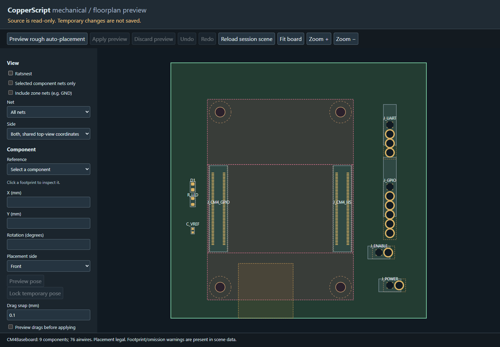

# Raspberry Pi Compute Module 4 baseboard

A real CM4 connector/mounting-pattern example using importable mechanical
profiles, not a fictional host. **This is a routed carrier prototype, not an
order-ready PCB.** The installed CM4 must have eMMC with its OS already flashed
using a CM4IO or another USB-capable carrier. CM4 Lite and CM5 are not supported
by this example. No firmware is supplied.

The 70 x 70 mm, four-layer carrier contains two Hirose
`DF40C-100DS-0.4V(51)` sockets, regulated external 5 V input, a 3.3 V UART
header, four GPIO signals, a GLOBAL_EN shutdown jumper, a low-current activity
LED, and GPIO_VREF decoupling. The module itself is removable and purchased
separately, not an extra soldered footprint/BOM item.



Pink regions reserve the module body; the orange region is the antenna copper
keepout. This preview deliberately shows placement only, not completed routing.

## Reusing the mechanical pattern

`board.copper` owns electrical connections. `mechanics/carrier.copper` owns
the carrier outline, rules and four-layer antenna keepout. It imports
`cm4.CM4Mounting` from **CopperLib via its GitHub package URL**, then explicitly
binds its `gpio` and `high_speed` roles to the two sockets. No manual CopperLib
checkout is needed. `copper.mod` pins one revision; `copper.lock` authenticates
the downloaded library content. Local mechanical files remain editable.

The profile gives both connectors a 270-degree orientation and locks their
actual pad-1 positions, not guessed body centres. All 200 placed pad centres
are checked against Raspberry Pi's official CM4IO v5 carrier footprint.
It also contributes four M2.5 mounting positions with 2.7 mm NPTH carrier
drills, spaced 33 x 48 mm. The module envelope is x=10..50, y=10..65 mm.
There is no profile transform at the use site yet; changing this datum requires
an explicit profile revision, not moving one connector independently.

The selected 1.5 mm mating height leaves **no spare component height below the
CM4**. Front placement keepouts reserve its body, with two narrow courtyard
corridors for the sockets. Do not add other parts in those corridors. The
antenna clearance spans x=18.5..33.5, y=55..70 mm, excludes all copper on all
four layers, and reaches the bottom board edge. This is a conservative
projection of the datasheet's preferred antenna clearance, not RF qualification
or enclosure validation. Check the assembled module, screw/spacer heights,
cooling and surrounding metal in 3D before manufacture.

## Run from a CopperScript checkout

At the repository root, install the project once with `uv sync --extra test`.
KiCad footprint libraries must be installed and supplied explicitly. On Windows:

```powershell
uv run --no-sync copper check examples/cm4_baseboard/board.copper --locked
uv run --no-sync copper plan-layout examples/cm4_baseboard/board.copper --locked `
  --layers 4 --fab-profile jlcpcb-four-layer `
  --footprint-root "C:/Program Files/KiCad/10.0/share/kicad/footprints" `
  -o build/cm4-baseboard/cm4_baseboard.kicad_pcb `
  --report build/cm4-baseboard/placement.json
uv run --no-sync copper edit-mechanical examples/cm4_baseboard/board.copper --locked `
  --layers 4 --fab-profile jlcpcb-four-layer `
  --footprint-root "C:/Program Files/KiCad/10.0/share/kicad/footprints"
```

The editor shows the locked imported sockets, mounting holes, keepouts and
toggleable ratsnest. Wheel zoom and right-button pan work as in other examples.
Run a fresh editor session for this board; existing sessions retain their own
in-memory poses. The editor currently previews poses but does not save them.

On Linux/macOS with `make`, from this example directory:

```sh
make check
make layout
make edit
```

On Linux the shared Makefile uses `/usr/share/kicad/footprints` automatically.
Set `KICAD_FOOTPRINTS` when KiCad is installed somewhere else. macOS and other
custom installations should also provide that override.

The `Makefile` produces placement drafts under ignored `build/cm4-baseboard`.
It intentionally does not call this a release/manufacturing build.
After the initial dependency download, add `--offline` to CLI commands for
cached builds; the full KiCad footprint library still needs to be installed.

### Complete routing and ground fill

From the repository root (Windows, KiCad 10 installed):

```powershell
make EXAMPLE=cm4 route
```

The shared [Make workflow](../../docs/make-builds.md) fetches pinned imports if needed, runs package escape
and detailed routing with profiling enabled, then **saves the ground fills**
and runs native KiCad DRC on that exact output board. No rule relaxation or
via-in-pad permission is added. Default outputs go in a timestamped directory
under ignored `build/cm4-baseboard/runs/`; open its `board.kicad_pcb` in KiCad.
`route-report.json`, `kicad-drc.json`, logs, input/output hashes and performance
reports are retained together. Success requires zero native violations and
zero unconnected items; a failed build returns nonzero and retains diagnostics.

For Linux/macOS or another KiCad installation, supply paths explicitly:

```sh
make EXAMPLE=cm4 route \
  KICAD_CLI=/usr/bin/kicad-cli \
  KICAD_FOOTPRINTS=/usr/share/kicad/footprints
# Or from this example directory:
make route KICAD_CLI=/usr/bin/kicad-cli KICAD_FOOTPRINTS=/usr/share/kicad/footprints
```

Set `RESOLVE_ARGS="--locked --offline"` after the first dependency download.
`RUN_DIR` selects a new/empty directory below the repository's `build/`; repeat
runs default to fresh timestamped directories. Use `PROFILE=none` for timing
comparisons. GNU Make is required (`mingw32-make` is also supported on Windows).
The example Makefile contains settings only; the same `make/board.mk` recipes
compile and route other boards without custom per-example Python scripts.

## Header wiring

| Header | Pins in footprint-number order |
| --- | --- |
| J_POWER | 1: regulated +5 V input; 2: GND |
| J_UART | 1: CM4 3.3 V sense; 2: CM4 TX/GPIO14; 3: CM4 RX/GPIO15; 4: GND |
| J_GPIO | 1: CM4 3.3 V; 2: GPIO2; 3: GPIO3; 4: GPIO17; 5: GPIO27; 6: GND |
| J_ENABLE | 1: GLOBAL_EN; 2: GND; leave open normally, short to power off |

Supply regulated 4.75..5.25 V at J_POWER. There is no reverse-polarity,
overvoltage, fuse or USB-C power-negotiation circuitry: use a suitable bench
supply and verify power routing/current sharing before connecting hardware.
Hirose rates each contact at 0.3 A; a supply's rating does not prove the socket
contacts can carry that current evenly. Every fitted ground contact and all
six 5 V contacts need a real carrier connection, not a routing waiver.

UART requires enabling/configuring the appropriate CM4 UART. Use a **3.3 V
logic** adapter, not RS-232 or 5 V logic. Cross host RX/TX and never inject power
through J_UART/J_GPIO. CM4 3.3 V outputs supply GPIO_VREF and the LED; the
`external = true` 3.3 V declaration describes the plugged-in module's source,
not permission to attach an independent 3.3 V supply. GPIO2/GPIO3 already have
CM4 pullups; extra I2C hardware is not modeled or validated here.

## Validation and remaining work

ERC checks the socket pin map, required power/ground contacts, 5 V limits and
reserved pins. Sockets expose passive signal contacts; this is **not** a full
active CM4 peripheral/mux/power-state model. Electrical sequencing, backfeed,
timing, loading and firmware assignments still need review.

Routing verified with KiCad 10.0.6: **all 11 ordinary nets routed**, GND connected
through escapes and filled In1.Cu/B.Cu zones, **zero unconnected items and zero
native DRC violations**. A separate copper-layer audit found zero via/pad
overlaps and only horizontal, vertical or 45-degree segments. In2.Cu carries
most signal length; In1.Cu is the ground reference. Some 90-degree joins remain,
so this is a connectivity/DRC-verified prototype, not an optimized reference
layout. The pre-fill IR-only checker still reports GND open because it does not
model filled zone copper; native filled-board evidence closes that check.

No Gerbers/assembly release or production-ready claim is made. Power traces
currently use the prototype minimum width: power routing/current sharing,
thermal performance and protection require review before powering hardware.
Manufacturing export remains a separate step.
The pin headers also need exact orderable selections before assembly ordering.
USB recovery, SD/Lite support, Ethernet, HDMI, camera, display and PCIe are
deliberately absent rather than partially connected.

Sources: [CM4 datasheet](https://datasheets.raspberrypi.com/cm4/cm4-datasheet.pdf)
(Fig. 4 and Table 6), [official CM4IO design files](https://pip.raspberrypi.com/categories/1210-design-files),
and [Hirose connector](https://www.hirose.com/en/product/p/CL0684-4033-4-51).
The downloaded sources and hashes are recorded in CopperLib's
`packages/profiles/raspberry_pi/cm4/evidence`;
raw vendor files are not redistributed with this example.
